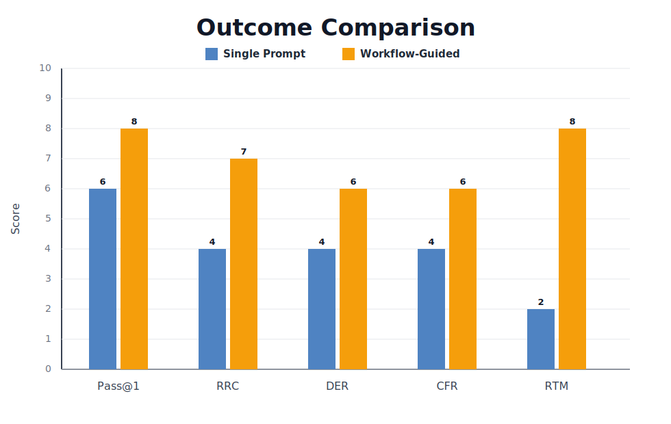

<!--
Function Name: README
Description: Public root README for the agent-workflows library.
-->

# Agent Workflows

Language: **English** | [简体中文](zh-cn/README.md)

Reusable engineering workflows for AI coding agents.

`agent-workflows` helps agents choose the right process for project initialization, feature work, bug fixes, code review, incident response, refactoring, and tech debt cleanup. The library separates workflow-specific guidance from shared safety, preflight, and validation conventions so the docs stay reusable and easier to maintain.

New to the library? Start with [how-to-use-agent-workflows.md](how-to-use-agent-workflows.md).

## Quick Start

Choose one workflow and follow it directly:

- New project or greenfield codebase: [project-initialization-agent-workflow.md](project-initialization-agent-workflow.md)
- New feature or product behavior change: [feature-development-agent-workflow.md](feature-development-agent-workflow.md)
- Existing behavior is broken: [bug-fix-agent-workflow.md](bug-fix-agent-workflow.md)
- Review a PR, branch, or diff: [code-review-agent-workflow.md](code-review-agent-workflow.md)
- Production incident or post-incident debugging: [incident-debugging-agent-workflow.md](incident-debugging-agent-workflow.md)
- Behavior-preserving structural improvement: [refactoring-agent-workflow.md](refactoring-agent-workflow.md)
- Cleanup, dependency upgrades, or debt survey: [tech-debt-cleanup-agent-workflow.md](tech-debt-cleanup-agent-workflow.md)

Manual usage example:

```text
Use the bug-fix workflow in bug-fix-agent-workflow.md for this issue:

<bug report>
```

Automation usage example:

```text
Use $workflow-automation to select the right workflow and execute it for this task:

<task description>
```

## Why Use Workflows Instead of a Single Prompt?

The difference is usually not raw model capability. It is process discipline: workflows force triage, validation, and handoff steps that ad hoc prompting often skips.

Workflows also help absorb silent base-model quality drift. If the underlying model becomes less careful, less reliable, or less consistent without an obvious product change, the workflow still adds checkpoints that reduce the chance of a major hidden drop in output quality.

The chart below comes from a 6-task exploratory Claude Code study. The full statistical protocol (blinded scoring, bootstrap confidence intervals, paired permutation tests with Holm–Bonferroni correction, inter-rater agreement) is defined in [evaluation/README.md](evaluation/README.md).



Scoring note: higher is better for every score.

Metric key:

- `TPR`: task pass rate — average task-level pass rate across repeated runs.
- `RP@k`: reliable pass at k — share of tasks where every repeated run passes.
- `CPR`: clean pass rate — share of runs that pass, validate, introduce no regression, and need no rework.
- `RFR`: regression-free rate — share of runs with no unrelated regression and, when declared, passing locked evaluator checks.
- `NRR`: no-rework rate — share of runs that need no repair pass.

Interpretation:

- `Task Pass Rate` improves because workflows help execution discipline and validation, not because they change the underlying model's raw capability.
- `Reliable Pass@k` improves more noticeably because workflows reduce variance by making the agent follow a stable sequence of triage, implementation, and validation steps.
- `Clean Pass Rate` is the strictest headline quality metric because a run must pass acceptance criteria, pass validation, avoid unrelated regressions, and need no repair pass.
- `Regression-Free Rate` and `No-Rework Rate` improve because workflows reduce mistakes by enforcing baseline capture, hidden regression/evaluator checks, and post-change revalidation.
- Workflows are also more resilient to silent base-model regressions, because process checkpoints catch quality drops that a one-shot prompt may otherwise let through unchecked.

## Available Workflows

- [project-initialization-agent-workflow.md](project-initialization-agent-workflow.md): Bootstrap a new project from requirements through scaffolding, validation, and handoff.
- [feature-development-agent-workflow.md](feature-development-agent-workflow.md): Design, implement, review, and hand off medium-to-large feature work.
- [bug-fix-agent-workflow.md](bug-fix-agent-workflow.md): Reproduce, diagnose, fix, and validate a bug.
- [code-review-agent-workflow.md](code-review-agent-workflow.md): Review code changes with structured findings and optional post-fix re-review.
- [incident-debugging-agent-workflow.md](incident-debugging-agent-workflow.md): Mitigate production impact first, then diagnose root cause and track follow-up work.
- [refactoring-agent-workflow.md](refactoring-agent-workflow.md): Improve structure without changing behavior, with baseline and revalidation steps.
- [tech-debt-cleanup-agent-workflow.md](tech-debt-cleanup-agent-workflow.md): Survey, scope, and execute cleanup work incrementally.

## Shared Building Blocks

- [shared/repository-preflight.md](shared/repository-preflight.md): Repository-aware preflight prompts for coding, review, and incident workflows.
- [shared/safety-rules.md](shared/safety-rules.md): Reusable safety-rule blocks for different workflow types.
- [shared/workflow-conventions.md](shared/workflow-conventions.md): Shared conventions for scope control, escalation, baselines, validation, and reporting.

## Bundled Skills

This repository includes Codex skills for using and maintaining the workflow library:

- [skills/workflow-automation/](skills/workflow-automation/): Routes tasks to the correct workflow and loads the minimum required files.
- [skills/project-initialization/](skills/project-initialization/): Bootstraps new projects and greenfield repositories using the project initialization workflow.
- [skills/workflow-maintainer/](skills/workflow-maintainer/): Audits workflow docs, shared references, skill metadata, links, and README inventory for drift.
- [skills/release-prep/](skills/release-prep/): Prepares release readiness reports, validation evidence, and release-note drafts.
- [skills/security-review/](skills/security-review/): Performs focused security reviews for auth, permissions, secrets, injection, data exposure, and dependency risk.
- [skills/test-strategy/](skills/test-strategy/): Designs behavior-to-coverage matrices, regression plans, QA steps, and validation command sets.
- [skills/migration-planning/](skills/migration-planning/): Plans safe schema, data, API, contract, and rollout migrations.
- [skills/performance-review/](skills/performance-review/): Reviews changes for scalability, query, caching, memory, latency, and load risks.
- [skills/docs-maintenance/](skills/docs-maintenance/): Maintains documentation structure, examples, links, headings, and cross-file consistency.

Shared support files for bundled skills live in [skills/_shared/](skills/_shared/). This is not an installable skill; it contains reusable helper scripts and shared operating rules used by the skill folders.

Each installable skill includes one canonical agent metadata file:

- `agents/interface.yaml`

Typical setup:

1. Copy the needed folder from `skills/` into your Codex skills directory.
2. Make sure the skill can find this repository, either by running it from a workspace that contains `agent-workflows/` or by setting `AGENT_WORKFLOWS_ROOT`.
3. Invoke it with a task such as:

```text
Use $workflow-automation to route and execute the right workflow for this task:

<task description>
```

## Repository Structure

```text
agent-workflows/
|- README.md
|- how-to-use-agent-workflows.md
|- project-initialization-agent-workflow.md
|- feature-development-agent-workflow.md
|- bug-fix-agent-workflow.md
|- code-review-agent-workflow.md
|- incident-debugging-agent-workflow.md
|- refactoring-agent-workflow.md
|- tech-debt-cleanup-agent-workflow.md
|- shared/
|  |- repository-preflight.md
|  |- safety-rules.md
|  |- workflow-conventions.md
|- skills/
   |- _shared/
   |- workflow-automation/
   |- project-initialization/
   |- workflow-maintainer/
   |- release-prep/
   |- security-review/
   |- test-strategy/
   |- migration-planning/
   |- performance-review/
   |- docs-maintenance/
```

## When Not to Use This Library

- **One-line fixes** with no ambiguity (typo, constant, import) — just make the change.
- **Greenfield project setup without meaningful decisions** — if the project is a single script or throwaway prototype, scaffold it directly. For projects with real tech-stack, structure, or tooling decisions, use the [project initialization workflow](project-initialization-agent-workflow.md).
- **Infrastructure-as-code or CI/CD implementation changes** — the feature, bug-fix, refactoring, and cleanup workflows are oriented around application code. Code review and incident workflows can still be used to inspect infrastructure-related changes.
- **Pure documentation changes** (README updates, runbook creation) — the overhead of a full workflow is not justified.
- **Exploratory prototyping** — if the goal is to experiment and throw away code, skip the process.

If you are unsure, the triage gates inside each workflow will tell you to use a lighter process when the task is small enough.

## Contributing

Issues and pull requests are welcome.

When contributing:

- Keep workflow-specific guidance in the relevant workflow file.
- Move repeated boilerplate into `shared/` instead of copying it across multiple files.
- Keep the automation skill aligned with the workflow library when workflow names, paths, or shared conventions change.

## License

[MIT](LICENSE)
