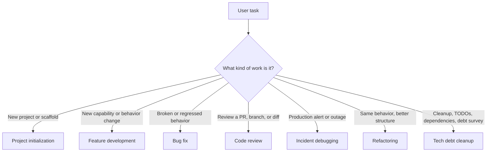

<!--
Function Name: how-to-use-agent-workflows
Description: User guide for choosing and applying agent-workflows manually or through bundled skills.
-->

# How to Use Agent Workflows

Language: **English** | [简体中文](zh-cn/how-to-use-agent-workflows.md)

Use this guide when you want to apply the workflow library to a real engineering task, either by reading the workflow files directly or by asking an agent to route the task for you.

## Choose a Workflow



Workflow files:

- [project-initialization-agent-workflow.md](project-initialization-agent-workflow.md): Start a new project or scaffold a greenfield repository.
- [feature-development-agent-workflow.md](feature-development-agent-workflow.md): Design and implement medium-to-large feature work.
- [bug-fix-agent-workflow.md](bug-fix-agent-workflow.md): Reproduce, diagnose, fix, and validate a bug.
- [code-review-agent-workflow.md](code-review-agent-workflow.md): Review code changes and report structured findings.
- [incident-debugging-agent-workflow.md](incident-debugging-agent-workflow.md): Mitigate production impact, gather evidence, and analyze root cause.
- [refactoring-agent-workflow.md](refactoring-agent-workflow.md): Improve structure while preserving behavior.
- [tech-debt-cleanup-agent-workflow.md](tech-debt-cleanup-agent-workflow.md): Survey, scope, and execute cleanup work.

## Use a Workflow Manually

Manual use works with any coding agent that can read repository files.

1. Pick the workflow file that matches the task.
2. Start with its preflight and triage sections.
3. Follow only the steps required by the triage result.
4. Keep the workflow file open as the source of truth.
5. Run the validation requested by the workflow.
6. End with the workflow's report or handoff format.

Example:

```text
Use the bug-fix workflow in bug-fix-agent-workflow.md for this issue:

<bug report, failing command, or error log>
```

For a feature:

```text
Use the feature development workflow in feature-development-agent-workflow.md for this change:

<feature overview>
<requirements>
<acceptance criteria>
```

For a review:

```text
Use the code review workflow in code-review-agent-workflow.md to review:

<PR link, branch name, or current workspace changes>
```

## Use Workflow Automation

The easiest path is the bundled [workflow-automation skill](skills/workflow-automation/). It locates the library, chooses the right workflow, loads the minimum required files, and applies the selected steps directly.

Example:

```text
Use $workflow-automation to route and execute the right workflow for this task:

<task description>
```

If the agent cannot find this library automatically, provide the repository path or set:

```bash
export AGENT_WORKFLOWS_ROOT=/path/to/agent-workflows
```

## Use a Specific Skill

Use a focused skill when the task already has a clear domain:

- `Use $project-initialization ...` for new projects and scaffolds.
- `Use $security-review ...` for auth, permission, secret, injection, or data exposure review.
- `Use $test-strategy ...` for coverage matrices, regression plans, and QA checklists.
- `Use $migration-planning ...` for schema, data, API, contract, or rollout migrations.
- `Use $performance-review ...` for latency, query, caching, memory, or scale risk.
- `Use $docs-maintenance ...` for README, links, examples, and documentation consistency.
- `Use $workflow-maintainer ...` for auditing this workflow library.
- `Use $release-prep ...` for release readiness and release-note handoff.

Typical setup:

1. Copy the needed folder from `skills/` into your agent's skills directory.
2. Run the agent from a workspace containing `agent-workflows/`, or set `AGENT_WORKFLOWS_ROOT`.
3. Invoke the skill by name in your task prompt.

## What the Agent Should Produce

| Situation | Expected output |
| --- | --- |
| Preflight | Applicable repo instructions, workspace state, unrelated changes, and constraints. |
| Triage | Workflow category and the steps that will be followed. |
| Planning or design | Confirmed requirements, assumptions, risks, open questions, and a concrete plan. |
| Implementation | Scoped changes, tests added or updated, validation commands, and known limits. |
| Review | Findings first, ordered by severity, with file locations and concrete recommendations. |
| Validation | Commands run, results, skipped checks with reasons, and remaining risks. |
| Handoff | Final report, follow-ups, and confirmation that no commit or push was performed unless explicitly approved. |

## When to Use a Lighter Path

Do not force a full workflow when the task is tiny and low-risk. A one-line typo, obvious import fix, or simple constant change can usually be handled directly with a short validation pass.

Use the full workflow when the task has ambiguity, cross-file impact, user-facing behavior, data or API contracts, permissions, migrations, production risk, or non-trivial test coverage needs.
