<!--
Function Name: README.zh-cn
Description: agent-workflows 库根 README 的简体中文翻译。
-->

# Agent 工作流

语言： [English](../README.md) | **简体中文**

面向 AI 编码代理的可复用工程工作流。

`agent-workflows` 帮助代理为项目初始化、功能开发、缺陷修复、代码评审、事故响应、重构和技术债清理选择合适流程。该库将工作流专属指导与共享的安全规则、预检和验证约定分离，使文档更易复用，也更容易维护。

第一次使用？请先阅读 [how-to-use-agent-workflows.md](how-to-use-agent-workflows.md)。

`zh-cn/` 目录保存的是中文文档镜像。实际脚本、代理元数据和可安装技能资产仍位于上层原始目录中。

## 快速开始

直接选择一个工作流并遵循它：

- 新项目或绿地代码库：[project-initialization-agent-workflow.md](project-initialization-agent-workflow.md)
- 新功能或产品行为变更：[feature-development-agent-workflow.md](feature-development-agent-workflow.md)
- 现有行为损坏：[bug-fix-agent-workflow.md](bug-fix-agent-workflow.md)
- 评审 PR、分支或 diff：[code-review-agent-workflow.md](code-review-agent-workflow.md)
- 生产事故或事故后的排障：[incident-debugging-agent-workflow.md](incident-debugging-agent-workflow.md)
- 保持行为不变的结构改进：[refactoring-agent-workflow.md](refactoring-agent-workflow.md)
- 清理、依赖升级或技术债巡检：[tech-debt-cleanup-agent-workflow.md](tech-debt-cleanup-agent-workflow.md)

手动使用示例：

```text
对这个问题使用 bug-fix-agent-workflow.md 中的缺陷修复工作流：

<bug report>
```

自动化使用示例：

```text
使用 $workflow-automation 为这个任务选择正确工作流并执行：

<task description>
```

## 为什么使用工作流，而不是单条提示词？

差异通常不在于模型原始能力，而在于流程纪律：工作流会强制执行分诊、验证和交接步骤，而这些步骤往往会在临时式提示中被跳过。

下图分数基于软件交付和代理评测中的常见经验判断，用来表达临时式提示与工作流引导执行之间的大致差异。若要运行对比，请使用上层目录中的评估套件 [evaluation/README.md](../evaluation/README.md)。

工作流也有助于缓冲模型基座暗中降智带来的影响。如果底层模型在没有明显产品变化的情况下变得更不仔细、更不稳定或更不一致，工作流仍然会通过额外的检查点，尽量避免产出质量出现严重且隐蔽的下滑。

```mermaid
---
config:
  xychart:
    width: 1100
    xAxis:
      labelFontSize: 12
---
xychart-beta
    title "估算结果对比"
    x-axis ["Pass@1", "RRC", "DER", "CFR", "RTM"]
    y-axis "Score" 0 --> 10
    bar "Single Prompt" [6, 4, 4, 4, 2]
    bar "Workflow-Guided" [8, 7, 6, 6, 8]
```



图例：`蓝色 = Single Prompt`，`橙色 = Workflow-Guided`

评分说明：所有柱子的分数都是越高越好。对 `DER` 和 `CFR` 来说，图里展示的是由这些指标换算后的正向质量分，所以柱子越高，表示缺陷逃逸率或变更失败率越低。

指标说明：

- `Pass@1`：单次尝试成功率。
- `RRC`：重复运行一致性。
- `DER`：缺陷逃逸率，但这里按“越高越好”的质量分表示。
- `CFR`：变更失败率，但这里按“越高越好”的质量分表示。
- `RTM`：需求可追踪性成熟度。

解读：

- `Pass@1` 只会小幅提升，因为工作流主要改善的是执行纪律，而不是模型本身的原始解题能力。
- `Repeated-Run Consistency` 会更明显地提升，因为工作流通过稳定的分诊、实现、验证顺序降低了运行波动。
- `Defect Escape Rate` 和 `Change Failure Rate` 会改善，但通常不会接近完美，因为工作流只能降低错误，不能消除测试薄弱、需求误解或高风险修改带来的问题。
- `Requirements Traceability` 提升最明显，因为工作流会明确记录假设、范围、验证证据和后续事项。
- 工作流对模型基座暗中降智也更有韧性，因为流程中的检查点更容易把质量下滑拦住，而单条提示词更可能让问题直接漏过去。

## 可用工作流

- [project-initialization-agent-workflow.md](project-initialization-agent-workflow.md)：从需求到脚手架、验证和交接，启动一个新项目。
- [feature-development-agent-workflow.md](feature-development-agent-workflow.md)：设计、实现、评审并交付中大型功能开发任务。
- [bug-fix-agent-workflow.md](bug-fix-agent-workflow.md)：复现、诊断、修复并验证一个缺陷。
- [code-review-agent-workflow.md](code-review-agent-workflow.md)：使用结构化发现项评审代码变更，并在需要时进行修复后复评。
- [incident-debugging-agent-workflow.md](incident-debugging-agent-workflow.md)：先缓解生产影响，再诊断根因并跟踪后续工作。
- [refactoring-agent-workflow.md](refactoring-agent-workflow.md)：在不改变行为的前提下改进结构，并包含基线与重新验证步骤。
- [tech-debt-cleanup-agent-workflow.md](tech-debt-cleanup-agent-workflow.md)：以增量方式盘点、界定并执行清理工作。

## 共享构件

- [shared/repository-preflight.md](shared/repository-preflight.md)：面向编码、评审和事故工作流的仓库感知型预检提示词。
- [shared/safety-rules.md](shared/safety-rules.md)：不同工作流类型共用的安全规则块。
- [shared/workflow-conventions.md](shared/workflow-conventions.md)：关于范围控制、升级、基线、验证和汇报的共享约定。

## 内置技能

此仓库包含若干 Codex 技能，用于使用和维护工作流库：

- [skills/workflow-automation/](skills/workflow-automation/)：将任务路由到正确工作流，并只加载最少必需文件。
- [skills/project-initialization/](skills/project-initialization/)：使用项目初始化工作流启动新项目和绿地仓库。
- [skills/workflow-maintainer/](skills/workflow-maintainer/)：审计工作流文档、共享参考、技能元数据、链接和 README 清单漂移。
- [skills/release-prep/](skills/release-prep/)：准备发布就绪性报告、验证证据和发布说明草稿。
- [skills/security-review/](skills/security-review/)：对认证、权限、密钥、注入、数据暴露和依赖风险进行聚焦安全评审。
- [skills/test-strategy/](skills/test-strategy/)：设计行为到覆盖的矩阵、回归计划、QA 步骤和验证命令集。
- [skills/migration-planning/](skills/migration-planning/)：规划安全的 schema、数据、API、契约和发布迁移。
- [skills/performance-review/](skills/performance-review/)：评审变更中的可扩展性、查询、缓存、内存、延迟和负载风险。
- [skills/docs-maintenance/](skills/docs-maintenance/)：维护文档结构、示例、链接、标题和跨文件一致性。

内置技能的共享支持文件位于 [skills/_shared/](skills/_shared/)。它不是可安装技能，而是保存可复用辅助脚本和共享执行规则的目录。

每个可安装技能都包含一个规范的代理元数据文件：

- `agents/interface.yaml`

典型设置方式：

1. 从上层原始 `../skills/` 目录中复制需要的技能目录到你的 Codex skills 目录。
2. 确保技能能找到这个仓库：要么在包含 `agent-workflows/` 的工作区中运行，要么设置 `AGENT_WORKFLOWS_ROOT`。
3. 通过类似下面的任务调用它：

```text
使用 $workflow-automation 为这个任务路由并执行正确的工作流：

<task description>
```

## 仓库结构

```text
agent-workflows/zh-cn/
|- README.md
|- how-to-use-agent-workflows.md
|- project-initialization-agent-workflow.md
|- feature-development-agent-workflow.md
|- bug-fix-agent-workflow.md
|- code-review-agent-workflow.md
|- incident-debugging-agent-workflow.md
|- refactoring-agent-workflow.md
|- tech-debt-cleanup-agent-workflow.md
|- shared/
|  |- repository-preflight.md
|  |- safety-rules.md
|  |- workflow-conventions.md
|- skills/
   |- _shared/
   |- workflow-automation/
   |- project-initialization/
   |- workflow-maintainer/
   |- release-prep/
   |- security-review/
   |- test-strategy/
   |- migration-planning/
   |- performance-review/
   |- docs-maintenance/
```

## 什么时候不该使用这个库

- **单行修复**：没有歧义的修改（错字、常量、import）直接改即可。
- **没有实质决策的新项目搭建**：如果项目只是单脚本或一次性原型，直接搭脚手架即可。若项目涉及真实的技术栈、结构或工具选择，请使用 [project initialization workflow](project-initialization-agent-workflow.md)。
- **基础设施即代码或 CI/CD 实现改动**：功能、缺陷修复、重构和清理工作流主要面向应用代码。代码评审和事故工作流仍可用于检查基础设施相关改动。
- **纯文档改动**（README 更新、运行手册编写）：完整工作流的成本通常不划算。
- **探索性原型**：如果目标是实验并丢弃代码，就跳过这套流程。

如果你不确定，各工作流中的分诊门会在任务足够小时提示你改用更轻量的流程。

## 贡献

欢迎提交 issue 和 pull request。

参与贡献时：

- 将工作流专属指导保留在对应工作流文件中。
- 把重复样板移动到 `shared/`，而不是复制到多个文件里。
- 当工作流名称、路径或共享约定变化时，保持自动化技能与工作流库同步。

## 许可证

[MIT](../LICENSE)
