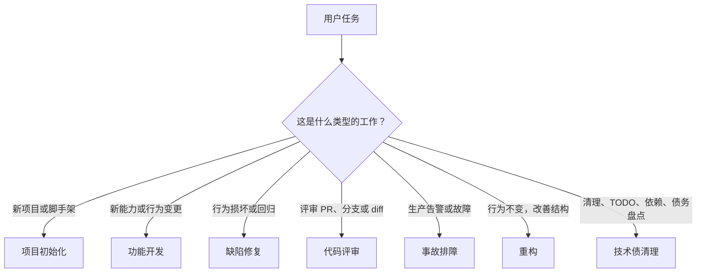

<!--
Function Name: how-to-use-agent-workflows.zh-cn
Description: agent-workflows 手动使用与技能使用指南的简体中文翻译。
-->

# 如何使用 Agent 工作流

语言： [English](../how-to-use-agent-workflows.md) | **简体中文**

当你想把这个工作流库应用到真实工程任务时，可以使用本指南。你可以直接阅读工作流文件，也可以让代理自动为任务选择合适工作流。

## 选择工作流



工作流文件：

- [project-initialization-agent-workflow.md](project-initialization-agent-workflow.md)：启动新项目或搭建绿地仓库脚手架。
- [feature-development-agent-workflow.md](feature-development-agent-workflow.md)：设计并实现中大型功能开发任务。
- [bug-fix-agent-workflow.md](bug-fix-agent-workflow.md)：复现、诊断、修复并验证缺陷。
- [code-review-agent-workflow.md](code-review-agent-workflow.md)：评审代码变更并输出结构化发现项。
- [incident-debugging-agent-workflow.md](incident-debugging-agent-workflow.md)：缓解生产影响、收集证据并分析根因。
- [refactoring-agent-workflow.md](refactoring-agent-workflow.md)：在保持行为不变的前提下改善结构。
- [tech-debt-cleanup-agent-workflow.md](tech-debt-cleanup-agent-workflow.md)：盘点、界定并执行清理工作。

## 手动使用工作流

手动方式适用于任何能读取仓库文件的编码代理。

1. 选择与任务匹配的工作流文件。
2. 从该文件的预检和分诊部分开始。
3. 只执行分诊结果要求的步骤。
4. 始终把工作流文件作为事实来源。
5. 运行工作流要求的验证。
6. 按工作流的报告或交接格式结束。

示例：

```text
对这个问题使用 bug-fix-agent-workflow.md 中的缺陷修复工作流：

<缺陷报告、失败命令或错误日志>
```

功能开发示例：

```text
对这个变更使用 feature-development-agent-workflow.md 中的功能开发工作流：

<功能概述>
<需求>
<验收标准>
```

代码评审示例：

```text
使用 code-review-agent-workflow.md 中的代码评审工作流评审：

<PR 链接、分支名或当前工作区变更>
```

## 使用工作流自动化

最省事的路径是使用内置的 [workflow-automation skill](skills/workflow-automation/)。它会定位工作流库、选择正确工作流、加载最少必需文件，并直接应用所选步骤。

示例：

```text
使用 $workflow-automation 为这个任务路由并执行正确的工作流：

<任务描述>
```

如果代理无法自动找到这个库，请提供仓库路径，或设置：

```bash
export AGENT_WORKFLOWS_ROOT=/path/to/agent-workflows
```

## 使用特定技能

如果任务领域已经很明确，可以直接使用聚焦技能：

- `Use $project-initialization ...` 用于新项目和脚手架。
- `Use $security-review ...` 用于认证、权限、密钥、注入或数据暴露评审。
- `Use $test-strategy ...` 用于覆盖矩阵、回归计划和 QA 清单。
- `Use $migration-planning ...` 用于 schema、数据、API、契约或发布迁移。
- `Use $performance-review ...` 用于延迟、查询、缓存、内存或规模风险。
- `Use $docs-maintenance ...` 用于 README、链接、示例和文档一致性。
- `Use $workflow-maintainer ...` 用于审计这个工作流库。
- `Use $release-prep ...` 用于发布就绪性和发布说明交接。

典型设置：

1. 从 `skills/` 中复制需要的技能目录到你的代理 skills 目录。
2. 在包含 `agent-workflows/` 的工作区中运行代理，或设置 `AGENT_WORKFLOWS_ROOT`。
3. 在任务提示词中按名称调用该技能。

## 代理应该输出什么

| 场景 | 期望输出 |
| --- | --- |
| 预检 | 适用的仓库说明、工作区状态、无关变更和约束。 |
| 分诊 | 工作流类别，以及将要执行的步骤。 |
| 规划或设计 | 已确认需求、假设、风险、开放问题和具体计划。 |
| 实现 | 范围受控的变更、新增或更新的测试、验证命令和已知限制。 |
| 评审 | 先输出发现项，按严重级别排序，包含文件位置和具体建议。 |
| 验证 | 已运行命令、结果、跳过检查及原因，以及剩余风险。 |
| 交接 | 最终报告、后续事项，以及除非明确批准否则未提交或推送的确认。 |

## 什么时候使用更轻量路径

任务很小且风险很低时，不要强行使用完整工作流。单行错字、明显的 import 修复或简单常量修改，通常可以直接完成并做一次简短验证。

当任务存在歧义、跨文件影响、用户可见行为、数据或 API 契约、权限、迁移、生产风险，或非平凡测试覆盖需求时，使用完整工作流。
